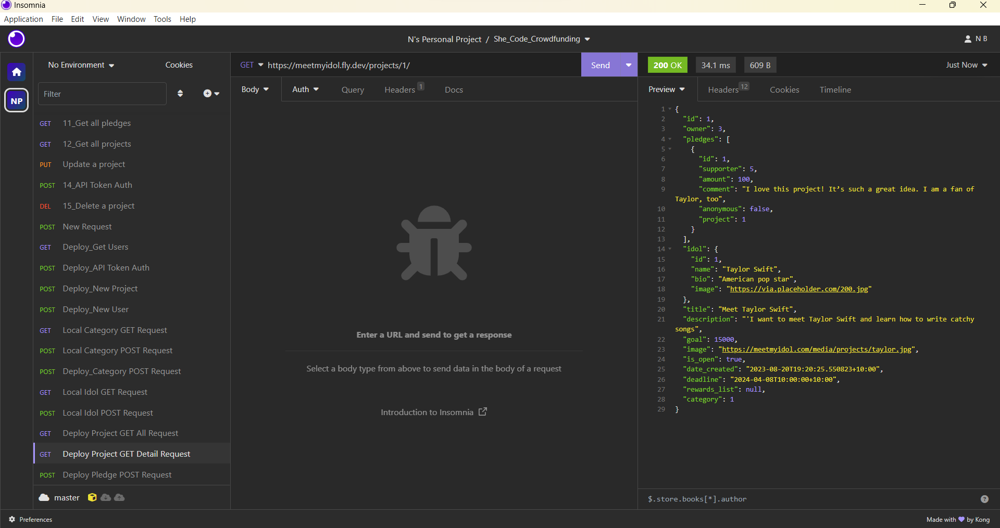
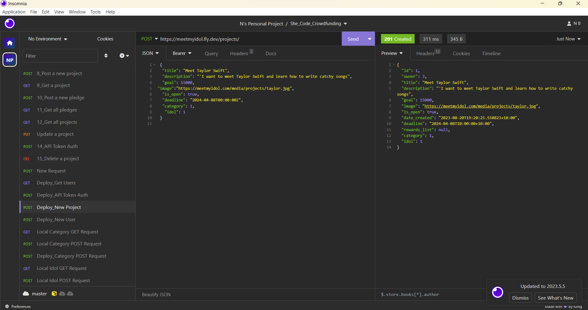
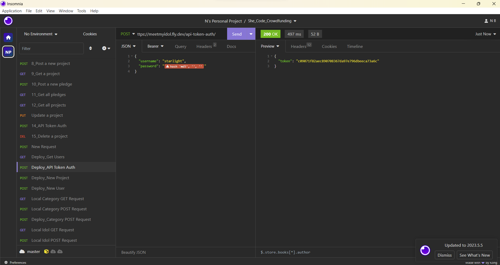

# she_codes_deployment

# Project Title: Meet My Idol
by {{ MW }}
She Codes crowdfunding project - DRF Backend.

## About
“MeetMyIdol” is a crowdfunding platform that connects aspiring talents with their idols. Whether you are passionate about music, film, or sports, you can raise funds to meet your idols and learn from their expertise and experience. With “MeetMyIdol”, you can turn your dreams into reality and get inspired by the best in your field.

## Features
* [x] user accounts
* [x] project creation
* [x] pledge creation        
* [x] token authentication
* [x] permissions
* [x] status codes
* [x] error handling

### Stretch Goals
{{ Outline three features that will be your stretch goals if you finish your MVP }}

* I spent time on understanding the nested serializers' behaviour. Unfortunately I have not be able to define my own function to acheive my goal. eg, I would like the foreign key fields in Project Class render a string, instead of a number from PK. 

## API Specification

| HTTP Method | Url | Purpose | Request Body | Successful Response Code | Authentication   Authorization
| --- | ------- | ------ | ---- | -----| ----|
| GET | projects/ | Return all projects | N/A | 200 | N/A |
| GET | projects/1/ | Return single projects | N/A | 200 | N/A |
| POST | projects/ | Create a new project | project object | 201 | User must be logged in. |
| GET | pledges/ | Return all pledges | N/A | 200 | N/A |
| GET | pledges/1/ | Return single pledge | N/A | 200 | N/A |
| POST | pledge/ | Create a new pledge | project object | 201 | User must be logged in. |
| POST | users/ | Create a new user | user object | 201 | N/A |
| GET | users/ | Get the user list | user object | 201 | N/A | 
| POST | api-token-auth/ | Generate a token for a user | user object | 201 | User must be logged in. |
| POST | idol/ | Create a new idol profile | project object | 201 | User must be logged in. |

## Database Schema
{{ Insert your database schema }}

## Wireframes
{{ Insert your wireframes }}

## Colour Scheme
{{ Insert your colour scheme }}

## Fonts
{{ outline your heading & body font(s) - TBC}}

## Submission Documentation

Deployed Project: [Deployed website](https://meetmyidol.fly.dev)

### How To Run
{{ What steps to take to run this code }}

### Updated Database Schema
{{ Updated schema }}

### How To Register a New User
To register a new user on “MeetMyIdol”, you need to follow these steps:

1. Go to the website: https://meetmyidol.fly.dev/users/
2. Click on the button "Join". Fill in your details including your username, email password. Make sure that your username is unique, your email is valid, and your password is strong and secure
3. Click on the “Register” button
4. Congratulations! You have registered a new user on “MeetMyIdol”. You can now log in with your username and password and start exploring the website.

### How To Register a New Project
To register a new project on “MeetMyIdol”, you need to follow these steps:

1. Login to website: https://meetmyidol.fly.dev/projects/
2. Click on the "Create a Project". You will be asked for your project title, description, goal, image, deadline, rewards list, category and idol.
3. Fill in the project details, make sure your project title is cathcy, your description is clear and compelling, your goal is realistic and achievable, your image is relevant and attractive, your deadline is reasonable and urgent, your rewards list is appealing and generous, your category is appropriate and specific, and your idol is relevant and popular
4. If your idol does not exist in the website database, you need to create a new idol profile before submitting your project. To do that, click on the "My Idol" button. Fill your idol details includes your idol name, bio, image, then click on the [submit idol button]. You will be redirected back to the create project page with your idol selected. (TBC)
5. Click on the [submit project button]
6. Congratulations! You have registered a new project on “MeetMyIdol”. You can now share your project with your friends and supporters and start raising funds to meet your idol.

### Screenshots
* [x] A screenshot of Insomnia, demonstrating a successful GET method for any endpoint.

* [x] A screenshot of Insomnia, demonstrating a successful POST method for any endpoint.

* [x] A screenshot of Insomnia, demonstrating a token being returned.
